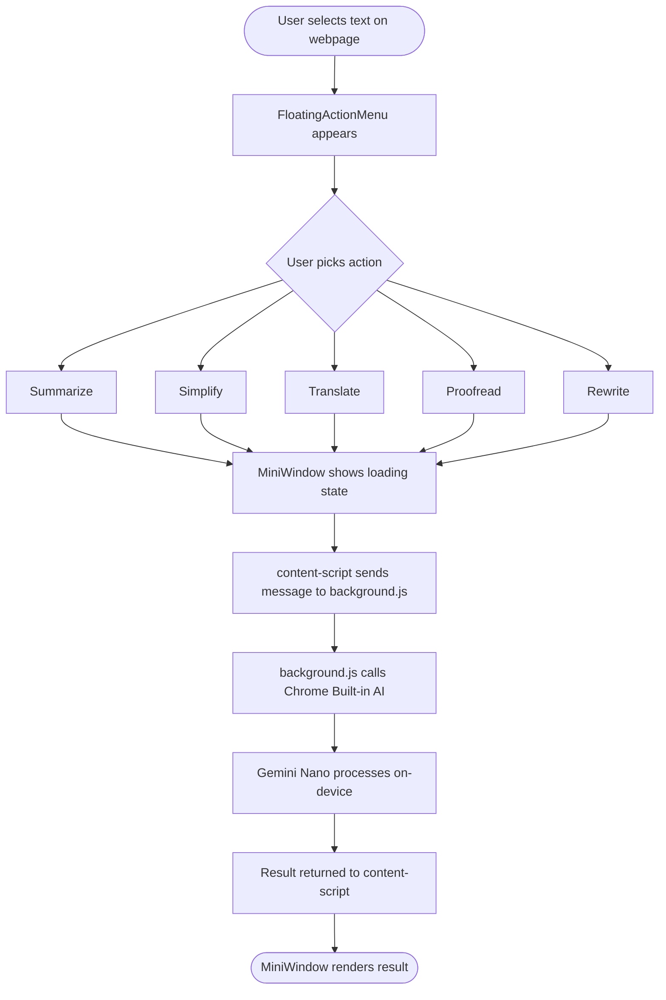
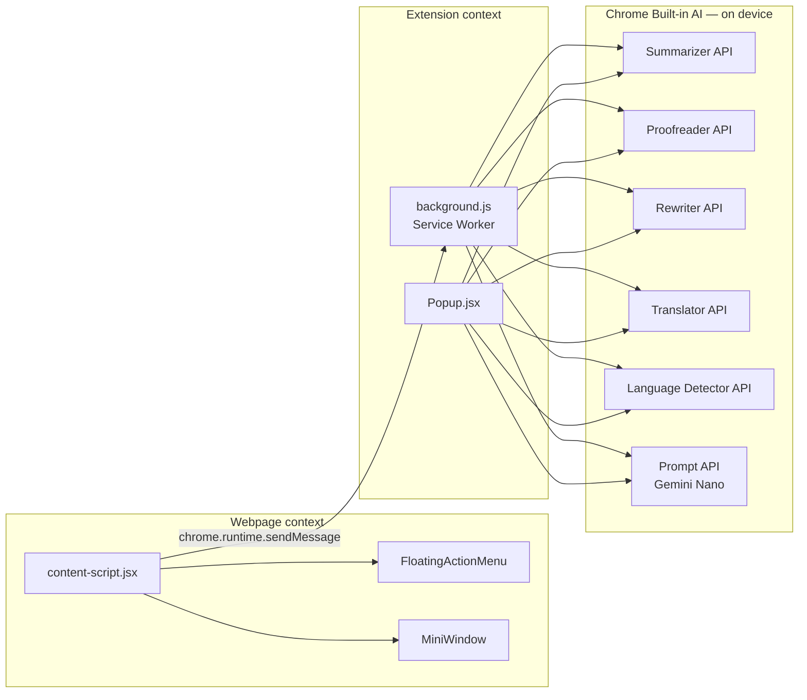
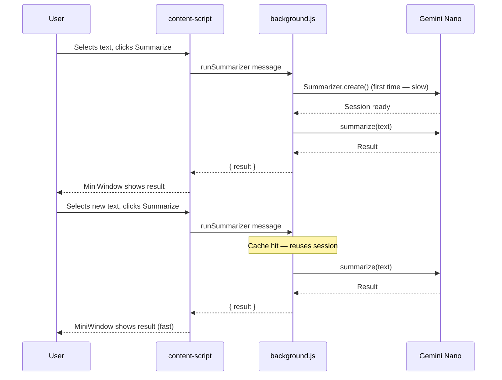

# WebMentor

> On-device AI assistant for the web. Select any text, instantly summarize, translate, simplify, proofread, or rewrite it, entirely in your browser, no cloud, no API keys, no data leaving your machine.

<br/>

## What it does

WebMentor adds a floating AI toolbar to every webpage. Select any text and five actions become available instantly:

| Action        | What it does                                                                  |
| ------------- | ----------------------------------------------------------------------------- |
| **Summarize** | Condenses long content into clear key points                                  |
| **Simplify**  | Rewrites complex text for kids, students, professionals, or a custom audience |
| **Translate** | Converts text between 11 languages with auto language detection               |
| **Proofread** | Fixes grammar, spelling, and style errors                                     |
| **Rewrite**   | Improves clarity and flow while preserving meaning                            |

All processing happens locally using **Gemini Nano** and Chrome's built-in AI APIs. No data is sent to any server.

<br/>

## Built with

- **Chrome Built-in AI** — Summarizer API, Translator API, Language Detector API, Rewriter API, Proofreader API, Prompt API (Gemini Nano)
- **React 19** — UI components
- **Framer Motion** — animations
- **Vite** — build tooling
- **Tailwind CSS** — utility styling

<br/>

## Requirements

- Chrome 138 or newer
- Windows 10/11, macOS 13+, or Linux
- 22GB+ free disk space (for Gemini Nano model)
- 4GB+ VRAM GPU **or** 16GB RAM with 4+ CPU cores

<br/>

## Getting started

### 1. Clone the repo

```bash
git clone https://github.com/dlawiz83/webmentor-extension.git
cd webmentor-extension/frontend
```

### 2. Install dependencies

```bash
npm install
```

### 3. Configure origin trial tokens

Create a `.env` file in the `frontend/` directory:

```env
VITE_CHROME_AI_TOKEN=your_proofreader_origin_trial_token
VITE_REWRITE_TOKEN=your_rewriter_origin_trial_token
```

Get your tokens from the [Chrome Origin Trials dashboard](https://developer.chrome.com/origintrials/).

### 4. Build

```bash
npm run build
```

### 5. Load in Chrome

1. Go to `chrome://extensions`
2. Enable **Developer mode** (top right)
3. Click **Load unpacked**
4. Select the `frontend/dist` folder

<br/>

## Development

For live rebuilds during development:

```bash
npm run watch
```

After each rebuild, click the refresh icon on the extension card in `chrome://extensions`, then refresh any open tabs.

<br/>

## Project structure

```
frontend/
├── public/
│   ├── background.js          # Service worker — all AI API calls run here
│   ├── manifest.json          # Extension manifest (MV3)
│   └── icons/
├── src/
│   ├── components/
│   │   ├── FloatingActionMenu.jsx   # Floating pill toolbar on text selection
│   │   └── MiniWindow.jsx           # Full result modal with audio playback
│   ├── Popup.jsx              # Extension popup UI
│   ├── content-script.jsx     # Injected into every page, handles selection
│   └── content.css            # Scoped styles for injected UI
├── .env                       # Origin trial tokens (not committed)
└── vite.config.js
```

<br/>

## How it works

### User flow



### Architecture



### Session caching



The background service worker handles all AI calls because Chrome's built-in AI APIs are not available in content scripts. Sessions are cached per action so subsequent calls skip model initialization entirely.

<br/>

## Supported languages (Translator)

> Some language pairs require the language pack to be installed via `chrome://on-device-translation-internals`.

<br/>

## Privacy

- **No data leaves your device.** All AI processing runs locally via Gemini Nano.
- **No analytics, no tracking, no accounts.**
- **No external API keys.** The extension uses Chrome's built-in models only.
- Origin trial tokens are scoped to this extension's ID and cannot be used elsewhere.

<br/>

## Browser support

| Browser      | Support                           |
| ------------ | --------------------------------- |
| Chrome 138+  | ✅ Full support                   |
| Chrome < 138 | ❌ Built-in AI APIs not available |
| Firefox      | ❌ Not supported                  |
| Safari       | ❌ Not supported                  |
| Edge         | ⚠️ Untested                       |

<br/>

## Known limitations

- First run of each AI action may take 5–15 seconds while Gemini Nano loads into memory
- Chrome may unload the model from memory after extended idle periods
- Proofreader and Rewriter require origin trial tokens (in active trial as of 2025)
- Translate requires Chrome's language packs for some language pairs

<br/>

## Roadmap

- [ ] Streaming output for faster perceived response
- [ ] History of past actions per session
- [ ] Custom simplification presets
- [ ] Right-click context menu integration
- [ ] Export results to clipboard with formatting

<br/>

## Contributing

Pull requests are welcome. For major changes please open an issue first.

```bash
# Run linting
npm run lint

# Build for production
npm run build
```

<br/>

## License

MIT © 2025 — built with Chrome's on-device AI

<br/>

---

<p align="center">
  Built using <a href="https://developer.chrome.com/docs/ai/built-in">Chrome Built-in AI</a> · Powered by Gemini Nano · Runs entirely on your device
</p>
